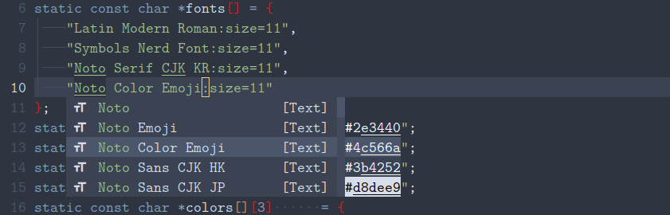

nvim-cmp-fonts
================

## Contents

-   <a href="#preview" id="toc-preview">Preview</a>
-   <a href="#introduction" id="toc-introduction">Introduction</a>
-   <a href="#dependencies" id="toc-dependencies">Dependencies</a>
-   <a href="#installation" id="toc-installation">Installation</a>
    -   <a href="#packernvim" id="toc-packernvim"><span>packer.nvim</span></a>
-   <a href="#setup" id="toc-setup">Setup</a>
    -   <a href="#only-for-certain-file-types"
        id="toc-only-for-certain-file-types">Only for certain file types</a>
-   <a href="#issues" id="toc-issues">Issues</a>

## Preview



## Introduction

nvim-cmp-fonts is a completion source for
[nvim-cmp](https://github.com/hrsh7th/nvim-cmp) that provides sources
for fonts. This is especially useful for editing
[configuration](#only-for-certain-file-types) file types. It gets them
from the fonts installed on your computer, which you can see by using
the `fc-list` command. Every time you open Neovim, the list of fonts is
updated.

## Dependencies

-   fontconfig

## Installation

It is important to run the generate script after installing the plugin.
Otherwise, the source will not be made.

### [packer.nvim](https://github.com/wbthomason/packer.nvim)

``` lua
require "packer".startup(function(use) use "amarakon/nvim-cmp-fonts" end)
```

## Setup

``` lua
require "cmp".setup { sources = { { name = "fonts" } } }
```

### Only for certain file types

``` lua
-- Only enable `fonts` for `conf` and `config` file types
require "cmp".setup.filetype(
    { "conf", "config" }, { sources = { { name = "fonts"} } }
)
```

## Issues

-   nvim-cmp expects each item to be a single word, which means it will
    not know if the word you are currently typing is a continuation of
    the previous word. Therefore, the font completion is sometimes
    inconsistent. This is an issue with nvim-cmp, not with my plugin.
    Here is a preview:

    

-   This plugin depends on fontconfig. If you do not have it installed
    on your system, it will not work. Maybe I can implement it without
    fontconfig.
